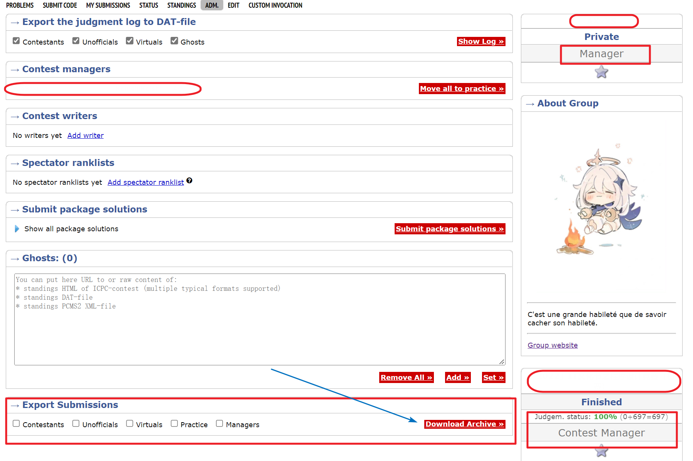
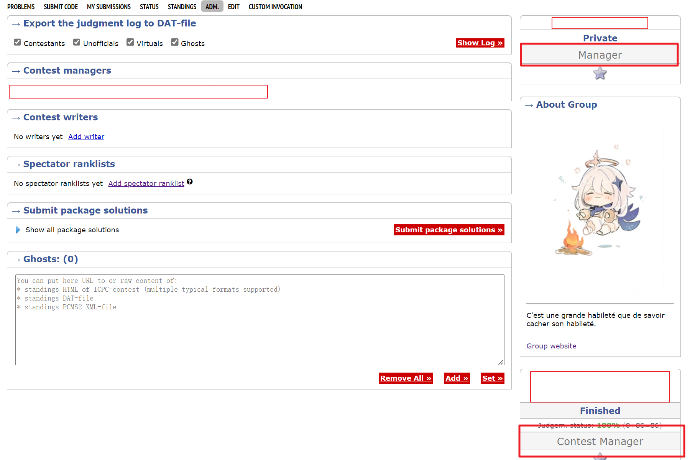
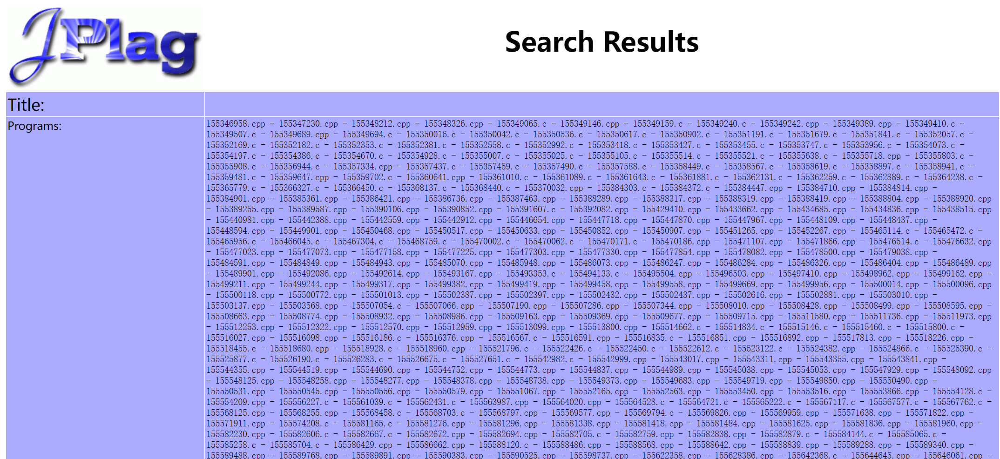
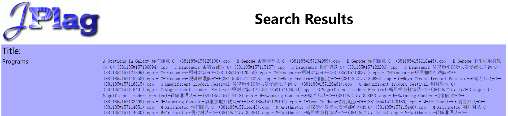
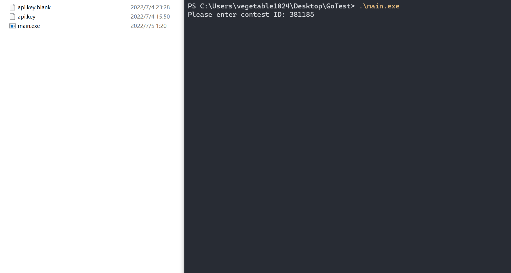

# Codeforces-ContestCodeDownload

## Q & A - Chinese

Q：这个工具有什么用？

A：他能帮助你下载一场比赛中所有正式参赛选手的代码。

Q：官方不是支持了导出代码功能吗？

A：是的，但官方导出的代码是以`SubmissionID`命名的。在需要将下载的代码文件进行统计时这会很麻烦。特别是我在使用`SIM`或`Jplag`等工具进行代码查重时，我无法快速地看出重复率高的代码来自谁，需要一个个点进链接去确认。

Q：那官方导出代码也基本够用了吧？

A：不，还有一个问题。在我尝试管理我的Group里其他管理员创建的比赛时，我无法导出比赛代码（截图展示在最下方）。我不清楚这是不是一个特例，但好像只有比赛的创建者才能进行代码导出操作。因此，这一小工具也是为了让所有的管理员都能下载比赛代码进行分析，归档。

Q：那我该怎么使用呢？

A：你只需要将`release`中的`main.exe`文件放到一个合适的目录，再创建一个名叫`api.key`的文件在同一目录下。然后，你需要在`api.key`里面配置你在`Codeforces`的`API KEY`，`API SECRET`，`USERNAME`，`PASSWORD`。注意，你需要使用JSON格式。最后，你只需要双击运行`main.exe`，输入对应的比赛编号就可以了，比赛的代码文件会自动下载到同一目录。如果你还没有`API KEY`或`API SECRET`，你可以在[Settings - Codeforces](https://codeforces.com/settings/api)里创建一个。

Q：比赛的代码文件会以什么方式命名便于查看？

A：目前的命名方式是：`题号-题目名称-选手名称-所用语言(比赛ID#提交ID)`。需要注意的是，我只特殊处理了C/C++/Java/Python这四类使用的最多的语言，其他语言提交的代码会以`.txt`结尾，并在`所用语言`上标记为`Other`。（截图展示在最下方）

Q：Github上没有类似的项目吗？我搜了一下好像很多下载脚本欸...

A：Github上的脚本大部分是下载某一用户的AC代码，或者是下载测试数据，或者是爬取PDF题面。但这个是针对下载正式比赛选手代码而设计的，暂时还没看到同款。

Q：好像没什么问题了...

A：其实还有点小问题。这次的核心代码用`Go`进行编写，因为初上手`Go`，而且时间较赶，其中的异常处理部分，日志部分，和数据库部分都还没有完成。因此`DEBUG`可能比较辛苦...

此外，未添加多线程，下载速度可能有限。

## Q & A - English

Q: What does this tool do?

A: It can help you download the codes of all the official participants in a contest.

Q: Isn't the official export code function supported?

A: Yes, but the official exported code's files are named by SubmissionID. This can be troublesome when you need to analyse the downloaded code files. Especially when I use tools like SIM or Jplag to check the code, I can't quickly see who the code with high duplication rate comes from, so I need to click the links one by one to confirm.

Q: So if I don't detect code duplication, the official system is good enough?

A: No, there is one more problem. When I try to manage contests created by other admins in my Group, I can't export the contest code (screenshot shown at the bottom). I'm not sure if this is a special case, but it seems that only the creator of the contest can perform the code export operation. So, this tool is also designed to allow all  managers to download the contest code for analysis and archiving.

Q: So how do I use it?

A: You just need to put the `main.exe`  from the release into a suitable directory and create a file named `api.key` in the **same directory**.  Note that you need to fill this out in **JSON format**. After that, you need to configure your `API KEY`, `API SECRET,` `USERNAME`, `PASSWORD` in `api.key` inside Codeforces. Finally, you just need to double click to run `main.exe` and enter the corresponding contest number, and the code file of the contest will be downloaded to the same directory automatically. If you don't have an `API KEY` and `API SECRET` yet, you can create one in [Settings - Codeforces](https://codeforces.com/settings/api).

Q: In what way will the contest code files be named for easy viewing?

A: The current naming scheme is: `[problem index]-[problem name]-[contestant name]-[language used]([contest ID]#[submission ID])`. Note that I have only specially handled the four most used languages, C/C++/Java/Python, and the code submitted in other languages will end with `.txt` and be marked as `Other` on the language used. (screenshots are shown at the bottom)

Q: No similar projects on Github? I looked it up, and it looks like there's a lot of download scripts...

A: Most of the scripts on Github are downloading a user's AC code, or downloading test data, or crawling PDF statements. But this is for downloading the official competition source code, have not yet seen the same.

Q: There seems to be no more problems...

A: Actually, there is still a little problem. This code is written by Go, and I'm a pupil to learn Go... Also, because in a hurry, the exception handling part, the logging part, and the database part are not finished yet. So DEBUG may be more difficult ...

In addition, no multi-threading has been added, so the download speed may be limited.

## Screenshots

#### Manager, can export submissions.

---

#### Manager, but can't export submissions.

---

#### Need to further confirm the relationship between the user and the submitted code.

---

#### The relationship between the user and the submitted code is quickly confirmed.

---

#### Presentation

