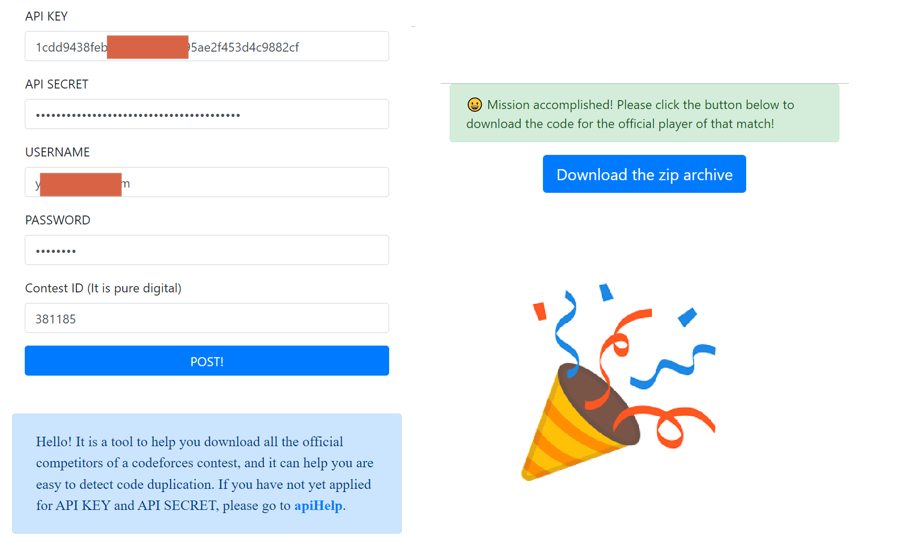

# Codeforces-ContestCodeDownload

## ✨ UPDATE 2022.07.25
✌ The first web version has been released, written on the Gin, and can be deployed on any machine you like! [Download it now!](https://github.com/Yuzu815/Codeforces-ContestCodeDownload/releases/latest)

Demo: You can choose the rear any site: &emsp; 🤠[Site A](https://accelerate-cf-demo.webdisk.online) &ensp; | &ensp; 🧐[Site B](https://cf-demo.webdisk.online).

**Attention: In demo, we do not collect your password. However, during the code download process, all records in the contest will be stored in a log for bug resolution.**

## ❓ Q & A

Q: What does this tool do?

A: It can help you download the codes of all the official participants in a contest.

Q: Isn't the official export code function supported?

A: Yes, but the official exported code's files are named by Submission ID. It is troublesome when you need to analyze the downloaded code files. Especially when I use tools like `SIM` or `Jplag` to check the code, I can't quickly see who the code with a high duplication rate comes from, and I need to click the links one by one to confirm.

Q: So if I don't detect code duplication, the official system is good enough?

A: No, there is one more problem. When I try to manage contests created by other managers in my Group, I can't export the contest code (screenshot shown at the bottom). I'm not sure if this is a special case, but it seems that only the creator of the contest can perform the code export operation. So, this tool is also designed to allow all managers to download the contest code for analysis and archiving.

Q: So how do I use it?

A: You just need to put the main.exe from the release into a suitable directory and create a file named `api.key` in the **same directory**. Note that you need to fill this out in **JSON format**. After that, you need to configure your `API KEY`, `API SECRET`, `USERNAME`, and `PASSWORD` in `api.key` inside Codeforces. Finally, you just need to double-click to run main.exe and enter the corresponding contest number, and the code file of the contest will be downloaded to the same directory automatically. If you don't have an `API KEY` and `API SECRET` yet, you can create one in [Settings - Codeforces](https://codeforces.com/settings/api).

Q: In what way will the contest code files be named for easy viewing?

A: The current naming scheme is: `[problem index]-[problem name]-[contestant name]-[language used]([contest ID]#[submission ID])`. Note that I have only specially handled the four most used languages, C/C++/Java/Python, and the code submitted in other languages will end with `.txt` and be marked as Other on the `language used`. (screenshots also are shown at the bottom)

Q: No similar projects on Github? I looked it up, and it looks like there are a lot of download scripts...

A: Most of the scripts on Github are downloading a user's AC code, downloading test data, or crawling PDF statements. But this is for downloading the official competition source code, have not yet seen the same.

Q: There seem to be no more problems...

A: Actually, there is still a little problem. The code is written in Go, and I'm just a beginner to Go... Also, because in a hurry, the exception-handling part, the logging part, and the database part are not finished yet. So DEBUG may be more difficult ...

In addition, no multi-threading has been added, so the download speed may be limited.

## 🎈 Screenshots

- **Manager, can export submissions.**

---

- **Manager, but can't export submissions.**

---

- **Need to further confirm the relationship between the user and the submitted code.**

---

- **The relationship between the user and the submitted code is quickly confirmed.**

---

## 🎨 Presentation-Cli

## ☕ Donate

If you like this project, for the author to buy a cup of coffee, please!

### TON

**ton://transfer/EQCeDSzxHt06YSFRJ644-T3jS_qL46SH2S4Gnlp96yt2dAtq**

### WeChat QR code

## 😶 Star 

